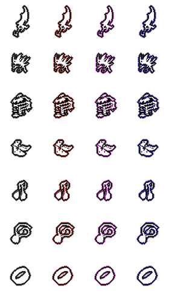

# My Game

## Table of contents
* [General info](#general-info)
* [Gambler](#gambler)
* [Inventory](#inventory)
* [Gameplay](#gameplay)
* [Entities](#entities)
* [Effects](#effects)

## General info
The initial implementation phase of the game is based on the tutorial:  
https://www.youtube.com/watch?v=9dzhgsVaiSo&t=1784s    
https://github.com/foreignguymike/legacyYTtutorials/tree/master/dragontale  

## Gambler
Mechanism for drawing inventory items:

## Inventory
Items spritesheet (slightly modified textures from the Metin2 game): 

Mechanism for putting on, taking off, upgrading inventory items:

## Gameplay
Some gameplay:

	
## Entities

Player spritesheet:

All entities:

## Effects

Effects spritesheet:

All effects:

